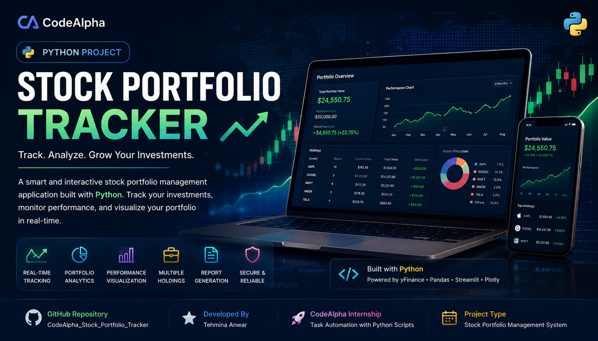

<div align="center">



<br><br>

# 📈 STOCK PORTFOLIO TRACKER

### 💹 Smart Stock Analysis & Portfolio Management

**CodeAlpha Internship — Task 2**

<p>
  <b>Stock Portfolio Tracking with Python & Streamlit</b>
</p>

<p>
  👩‍💻 <b>Created by Tehmina Anwar</b>
</p>

<br>

<a href="https://codealphastockportfoliotracker-e37jslqdeyuen7savappjbv.streamlit.app/">
  
</a>

<a href="https://github.com/Tehmina124/CodeAlpha_Stock_Portfolio_Tracker">
  
</a>

</div>

---

## 🌟 Project Overview

**Stock Portfolio Tracker** is a Python-based financial tracking application developed for **CodeAlpha Internship — Task 2**.

The application allows users to enter stock holdings, track their portfolio value, calculate profit or loss, and visualize portfolio performance through interactive charts.

Built with **Python, Streamlit, Pandas, yFinance, and Matplotlib**, this project provides a simple and interactive dashboard for monitoring stock investments.

---

## 🚀 Live Demo

<div align="center">

### 🎯 Try Stock Portfolio Tracker Online

<a href="https://codealphastockportfoliotracker-e37jslqdeyuen7savappjbv.streamlit.app/">


</a>

<br><br>

👉 **Live App:**
https://codealphastockportfoliotracker-e37jslqdeyuen7savappjbv.streamlit.app/

</div>

---

## ✨ Key Features

<table>
<tr>
<td width="50%">

### 📊 Portfolio Tracking

Track multiple stocks in one dashboard.

### 💰 Investment Calculation

Calculate total investment based on stock quantity and purchase price.

### 📈 Current Market Value

Fetch current stock prices and calculate the current portfolio value.

### 💹 Profit & Loss

Automatically calculate profit or loss for individual holdings and the complete portfolio.

</td>

<td width="50%">

### 📉 Stock Price Charts

Visualize historical stock price movements.

### 🧮 Portfolio Summary

Display total investment, current value, and overall profit/loss.

### 🌐 Real-Time Market Data

Use Yahoo Finance data through the `yfinance` library.

### 🎨 Interactive Streamlit UI

Simple and user-friendly dashboard for portfolio analysis.

</td>
</tr>
</table>

---

## 🔄 How It Works

```text
                 📥 ENTER STOCK DETAILS
                         │
                         ▼
                  🏷️ STOCK SYMBOL
                         │
                         ▼
                   🔢 QUANTITY
                         │
                         ▼
                💵 PURCHASE PRICE
                         │
                         ▼
                  📊 FETCH MARKET DATA
                         │
                         ▼
                 💰 CALCULATE VALUE
                         │
                         ▼
                 📈 PROFIT / LOSS
                         │
                         ▼
                 📉 VISUALIZE DATA
                         │
                         ▼
                 📊 PORTFOLIO SUMMARY
```

---

## 📋 Portfolio Information

The application can track important information such as:

| Information           | Description                                     |
| --------------------- | ----------------------------------------------- |
| 🏷️ **Stock Symbol**  | Stock ticker symbol                             |
| 🔢 **Quantity**       | Number of shares owned                          |
| 💵 **Purchase Price** | Price paid per share                            |
| 📈 **Current Price**  | Latest available market price                   |
| 💰 **Investment**     | Total amount invested                           |
| 💹 **Current Value**  | Current portfolio value                         |
| 📊 **Profit/Loss**    | Difference between current value and investment |

---

## 📊 Portfolio Dashboard

The dashboard provides a quick overview of the portfolio:

```text
┌─────────────────────┬─────────────────────┐
│ 💵 Total Investment │ 💰 Current Value    │
├─────────────────────┼─────────────────────┤
│      $XX,XXX        │      $XX,XXX        │
└─────────────────────┴─────────────────────┘

┌─────────────────────┬─────────────────────┐
│ 📈 Profit/Loss      │ 📊 Holdings         │
├─────────────────────┼─────────────────────┤
│      $X,XXX         │        XX           │
└─────────────────────┴─────────────────────┘
```

---

## 📈 Stock Market Data

The project uses **Yahoo Finance data** through the `yfinance` Python library.

The application can retrieve market information based on stock ticker symbols.

Example symbols:

```text
AAPL
MSFT
GOOGL
AMZN
TSLA
NVDA
```

---

## 📉 Data Visualization

The application uses charts to make stock performance easier to understand.

### Chart Features

* 📈 Historical stock price visualization
* 📊 Portfolio performance overview
* 💹 Profit/loss analysis
* 📉 Market trend visualization

---

## 💰 Profit & Loss Calculation

The application calculates portfolio performance using:

```text
Total Investment
= Quantity × Purchase Price
```

```text
Current Value
= Quantity × Current Market Price
```

```text
Profit/Loss
= Current Value − Total Investment
```

This allows users to quickly understand whether their portfolio is currently gaining or losing value.

---

## 🛠️ Tech Stack

<div align="center">


</div>

---

## 📦 Libraries Used

```text
streamlit
pandas
yfinance
matplotlib
datetime
```

---

## 📁 Project Structure

```text
📦 CodeAlpha_Stock_Portfolio_Tracker
│
├── 📄 app.py
├── 📄 requirements.txt
├── 🖼️ STOCK.png
└── 📄 README.md
```

---

## ⚙️ Installation

### 1️⃣ Clone the Repository

```bash
git clone https://github.com/Tehmina124/CodeAlpha_Stock_Portfolio_Tracker.git
```

### 2️⃣ Open the Project

```bash
cd CodeAlpha_Stock_Portfolio_Tracker
```

### 3️⃣ Install Dependencies

```bash
pip install -r requirements.txt
```

### 4️⃣ Run the Application

```bash
streamlit run app.py
```

---

## 📄 requirements.txt

```text
streamlit
pandas
yfinance
matplotlib
```

---

## 🎯 CodeAlpha Internship

<div align="center">

### 💻 CodeAlpha Python Programming Internship

**Task 2 — Stock Portfolio Tracker**

</div>

This project demonstrates how Python can be used to create a practical stock portfolio tracking application with market-data integration, financial calculations, and data visualization.

---

## 👩‍💻 Developer

<div align="center">

# Tehmina Anwar

### AI/ML Engineer | Python Developer | Generative AI Enthusiast

**Python • Machine Learning • Deep Learning • Generative AI • LLMs • NLP • Computer Vision • Streamlit**

</div>

---

## 🌐 Connect With Me

<div align="center">

<a href="https://github.com/Tehmina124">

</a>

<a href="https://www.linkedin.com/in/tehmina-anwar-77b8a8414">

</a>

<a href="https://tehmina-portfolio-five.vercel.app/">

</a>

</div>

---

## ⭐ Project Status

<div align="center">

| Feature                      | Status |
| ---------------------------- | ------ |
| 📊 Portfolio Tracking        | ✅      |
| 💰 Investment Calculation    | ✅      |
| 📈 Current Market Value      | ✅      |
| 💹 Profit/Loss Calculation   | ✅      |
| 📉 Stock Price Charts        | ✅      |
| 🌐 Market Data Integration   | ✅      |
| 🎨 Streamlit Dashboard       | ✅      |
| 🚀 Live Streamlit Deployment | ✅      |

</div>

---

<div align="center">

## 📈 Track. Analyze. Invest Smarter.

### Made with ❤️ using Python & Streamlit

⭐ **If you like this project, consider starring the repository!**

</div>
